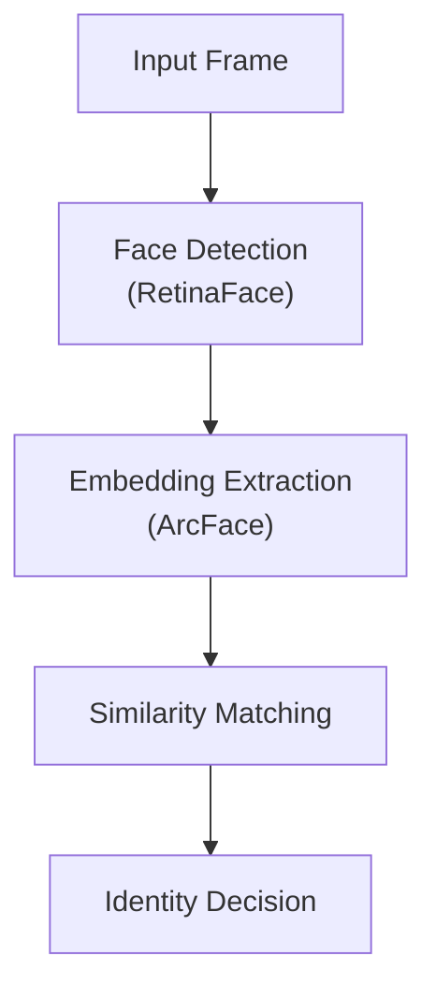
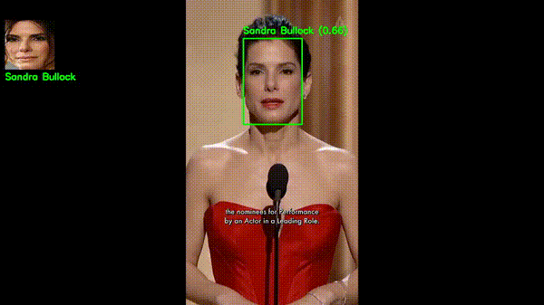

# Vision-Identity-Engine

Core identity recognition engine for real-time vision systems.

Vision-Identity-Engine is designed as a **modular, high-performance face identity recognition core**, focusing on detection, embedding extraction, similarity matching, and identity decision.  
It can be integrated into larger real-time vision systems such as CCTV analytics, access control, or edge AI pipelines.

---

## 🔍 Key Features

- Real-time face detection using RetinaFace
- High-quality face embeddings with ArcFace
- Cosine similarity–based identity matching
- Modular and extensible architecture
- ONNX / PyTorch friendly
- Designed for real-time and multi-camera systems

---

## 🧠 System Architecture



---

## 🧩 Pipeline Description

1. **Input Frame**  
   Frames are captured from video sources such as webcam, video files, or RTSP streams.

2. **Face Detection (RetinaFace)**  
   Detects faces and facial landmarks with robustness to pose and lighting variations.

3. **Embedding Extraction (ArcFace)**  
   Each detected face is transformed into a fixed-length embedding vector representing identity features.

4. **Similarity Matching**  
   Embeddings are compared against stored identity embeddings using cosine similarity.

5. **Identity Decision**  
   Based on similarity thresholds, the system determines whether the face belongs to a known or unknown identity.

---

## 📁 Project Structure

```
Vision-Identity-Engine/
├── models/
│   ├── retinaface/
│   └── arcface/
├── src/
│   ├── aligner.py
│   ├── config.py
│   ├── database.py
│   ├── detector.py
│   ├── embedder.py
│   ├── matcher.py
│   └── identity_engine.py
├── database/
│   └── identities
│       ├── person1
│       │      └── image1.jpg
│       └── person2
│              └── image2.jpg
├── demo.py
├── pyproject.toml
└── README.md
```

---
👉 ▶️ Watch demo video


## ⚙️ Installation

### Requirements

- Python 3.10 (recommended)
- Linux (x86_64)
- OpenCV
- ONNX Runtime or PyTorch
- insightface

### Setup

```bash
git clone https://github.com/PhuocHo12/Vision-Identity-Engine.git
cd Vision-Identity-Engine

uv sync
```

---

## ▶️ Quick Start

Run demo with webcam:

```bash
python demo.py --source 0
```

Run demo with RTSP stream:

```bash
python demo.py --source rtsp://user:password@ip/stream
```

---

## 🧪 Identity Matching Logic

- Similarity metric: **Cosine similarity**
- Threshold-based identity decision
- Supports 1:N matching and unknown identity detection

---

## 🚀 Use Cases

- Face recognition for CCTV systems
- Access control and attendance systems
- Smart retail analytics
- Edge AI vision pipelines

---

## 🗺️ Roadmap

- Multi-face tracking integration
- Vector database support (Milvus, Faiss)
- REST / gRPC inference service
- Docker deployment

---

## 📜 License

MIT License

---

## 🙌 Author

Built by **Phước Hồ**  
Focus: Computer Vision, OCR, and Large-Scale AI Systems